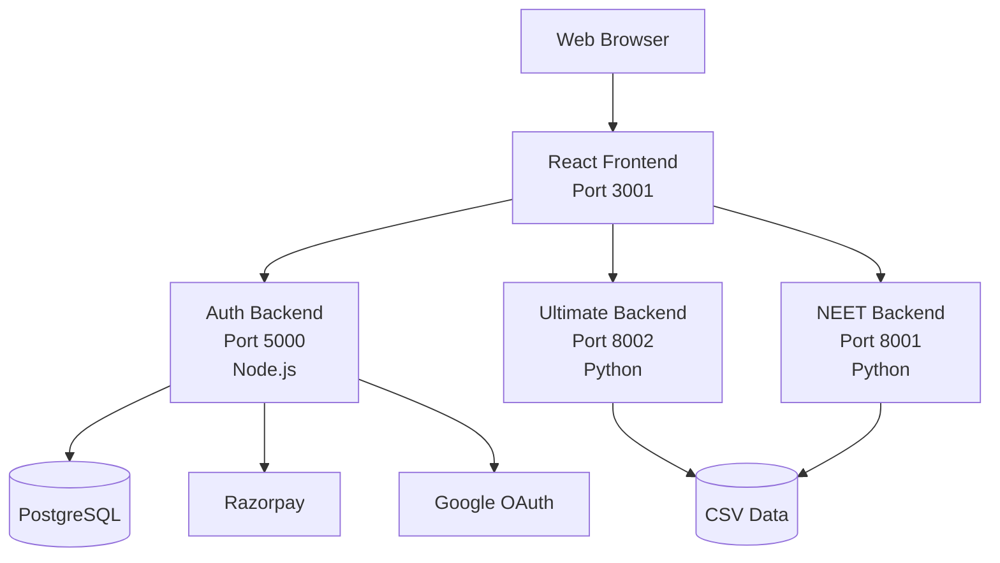

# 🎓 NEET College Finder

[](https://github.com/yourusername/college-finder)
[](https://python.org)
[](https://reactjs.org)
[](https://nodejs.org)
[](https://fastapi.tiangolo.com)

> AI-Powered Medical College Admission Prediction System with Authentication & Payment Integration

## System Architecture



## Features

- 🔍 Smart College Search with Multiple Filters
- 📊 Admission Probability Analysis
- 💰 Financial Planning & ROI Calculations
- 🔐 Secure JWT Authentication
- 💳 Razorpay Payment Integration
- 🌐 Google OAuth Login
- 📱 Responsive Mobile Design

## Tech Stack

**Frontend:** React 18, Vite, Tailwind CSS, Framer Motion

**Backend (Auth):** Node.js, Express, Prisma, PostgreSQL, JWT

**Backend (ML):** Python, FastAPI, Pandas, NumPy

## Quick Start

### Prerequisites
- Node.js 18+
- Python 3.9+
- PostgreSQL (or Neon DB)

### Installation

```bash
# Clone repository
git clone https://github.com/yourusername/college-finder.git
cd college-finder

# Setup Frontend
cd ML_frontend
npm install
cp .env.example .env

# Setup Auth Backend
cd ../auth_backend
npm install
cp .env.example .env
npm run prisma:generate
npm run prisma:push

# Setup Python Backends
cd ../ultimate_backend
pip install -r requirements.txt

cd ../neet_college_finder_backend
pip install -r requirements.txt
```

### Running

```bash
# Terminal 1
cd ML_frontend && npm run dev

# Terminal 2
cd auth_backend && npm run dev

# Terminal 3
cd ultimate_backend && python start_ultimate_server.py

# Terminal 4
cd neet_college_finder_backend && python start_server.py
```

**Access:**
- Frontend: http://localhost:3001
- Auth API: http://localhost:5000
- Ultimate API: http://localhost:8002/docs
- NEET API: http://localhost:8001/docs

## Project Structure

```
College-Finder/
├── ML_frontend/              # React application
├── auth_backend/             # Node.js auth API
├── ultimate_backend/         # FastAPI ML backend
├── neet_college_finder_backend/
├── data/raw/                 # CSV datasets
└── docs/                     # Documentation
```

## Configuration

### Frontend (.env)
```
VITE_ML_API_URL=http://localhost:8002
VITE_AUTH_API_URL=http://localhost:5000
```

### Auth Backend (.env)
```
DATABASE_URL=postgresql://...
JWT_SECRET=your_secret
RAZORPAY_KEY_ID=rzp_test_...
GOOGLE_CLIENT_ID=...
```

## Deployment

- **Frontend:** Vercel
- **Backend:** Railway/Render
- **Database:** Neon PostgreSQL

## License

MIT License

---

**Built with ❤️ for NEET aspirants**
